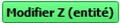

# Plugin QGis Altibonne

## Version 0.1.0 &nbsp;&nbsp;&nbsp;&nbsp;&nbsp;&nbsp; IGN - DTSO 

 
	 

| Version | Date  | Modifié par | Commentaire |
|--|--|--|--|
| 0.1 | 13/01/2026 | Gérôme PECHEUR | Création du manuel utilisateur  |

  <h2 style="color: #00ADC5">Sommaire</h2>

- [1. Prérequis](#1-prérequis)
- [2. Résumé](#2-résumé)
- [3. Installation](#3-installation)
- [4. Présentation](#4-présentation)
- [5. Utilisation](#5-utilisation)
  - [5.1 Modification des Z d'un linéaire entier](#51-modification-des-z-dun-linéaire-entier)
  - [5.2 Modification du Z d'un point](#52-modification-du-z-dun-point)
  - [5.3 Navigation](#53-navigation) 

  

  <h2 id="1-prérequis" style="color: #00ADC5" >1. Prérequis</h2>

Version de QGIS 3 : 3.28 ou supérieure.  
Ce plugin fonctionne en parallèle du plugin « IGN Espace collaboratif » version 4.2.2 et IGN_Maitre  

  <h2 id="2-résumé" style="color: #00ADC5">2. Résumé</h2>

  
  
Ce plugin permet : 
-	De visualiser un profil sur des entités linéaires.  
-	De « relever/abaisser » tous les z d’un linéaire.  
-	De modifier ponctuellement un z sur un linéaire.  

  
  

  <h2 id="3-installation" style="color: #00ADC5">3. Installation</h2>

  
  
Ouvrir QGIS.  
Allez dans **Extensions/Installer/Gérer les extensions**, cliquez sur **Installer depuis un ZIP**, sélectionner le fichier ZIP puis cliquez sur **Installer le plugin**.  

 
	 

  
  

  <h2 id="4-présentation" style="color: #00ADC5">4. Présentation</h2>

  
  

 
	 

  

- 1.	Zone d‘affichage du profil  
- 2.	Valeur de delta Z permettant de relever ou d’abaisser tous les Z du linéaire sélectionné.  
- 3.	Valeur du Z correspondant au point sélectionné sur le linéaire.  
- 4.	Valeur du Z interpolé du point sélectionné correspondant à l'interpolation avec le Z du point avant et après sur le linéaire. Cette valeur peut être modifiée.  
- 5.	Valide la modification du linéaire en prenant en compte le delta Z renseigné.  
- 6.	Valide la modification du Z du point sélectionné en prenant en compte le Z interpolé ou tout autre Z renseigné par l’utilisateur.  
- 7.	Seuil de détection de pente, les segments du profil qui sont hors du seuil apparaissent en rouge.  
- 8.	Permet d’actualiser la vue du profil après un changement du seuil de détection de pente.  
- 9.	Ouvre une fenêtre retraçant l’historique des versions, cette documentation y est également accessible.  

  

  <h2 id="5-mode-de-sélection" style="color: #00ADC5">5. Utilisation</h2>

### 5.1 Modification des Z d'un linéaire entier  
Après avoir renseigné un delta Z, le bouton  modifie les z de tous les points constituant le ou les linéaires sélectionnés.  
Le delta Z doit être compris entre -100 et 100 (mètres)  

### 5.2 Modification du Z d'un point  
Il faut sélectionner un point du linéaire sur le profil (clic gauche).  
Sur l’interface, le Z actuel du point est renseigné.  
Le Z interpolé est également renseigné. L’utilisateur peut modifier cette valeur s’il souhaite donner un Z différent de celui proposé.  
Le bouton  modifie le Z du point sélectionné.  
L’interface s’actualise afin d’afficher le nouveau profil.  

### 5.3 Navigation  
Il est possible de :  
- 1.	Agrandir/rétrécir l’interface --> le profil suit.  
- 2.	Se déplacer dans le profil avec un clic gauche + déplacement (en dehors d’un point)  
- 3.	Zoomer dans le profil avec la molette de la souris  

