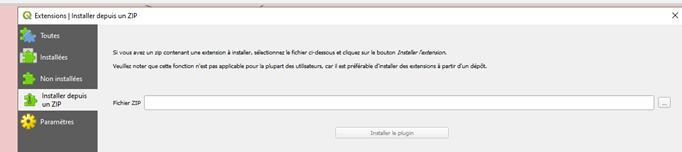
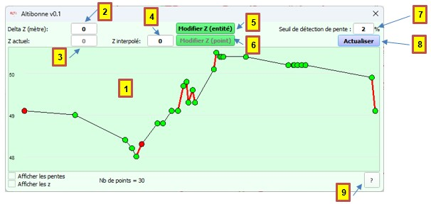

<table>
<colgroup>
<col style="width: 21%" />
<col style="width: 78%" />
</colgroup>
<tbody>
<tr>
<td rowspan="2"></td>
<td style="font-size: 24px;text-align: center;">
<strong>Manuel utilisateur du plugin
« Altibonne »</strong>

<strong>V0.3.1</strong>
</td>
</tr>
<tr>
<td style="font-size: 16px;text-align: center;">Développeur  : Gérôme PECHEUR (IGN)</td>
</tr>
</tbody>
</table>

## Sommaire

- [1. Prérequis](#prerequis)
- [2. Résumé](#resume)
- [3. Installation](#installation)
- [4. Présentation](#presentation)
- [5. Utilisation](#5utilisation)
  - [5.1 Modification des Z d'un linéaire entier](#modification-des-z-dun-lineaire-entier)
  - [5.2 Modification du Z d'un point](#modification-du-z-dun-point)
  - [5.3 Navigation](#navigation) 

  

  <h2 id="prerequis" style="color: white;margin:0;" >1. Prérequis</h2>

Version de QGIS 3 : 3.28 ou supérieure.  
Ce plugin fonctionne en parallèle du plugin « IGN Espace collaboratif » version 4.2.2 et IGN_Maitre  

  <h2 id="resume" style="color: white;margin:0;" >2. Résumé</h2>

Ce plugin permet : 
-	De visualiser un profil sur des entités linéaires.  
-	De « relever/abaisser » tous les z d’un linéaire.  
-	De modifier ponctuellement un z sur un linéaire.  

  
  

  <h2 id="installation" style="color: white;margin:0;" >3. Installation</h2>

 

Ouvrir QGIS.  
Allez dans **Extensions/Installer/Gérer les extensions**, cliquez sur **Installer depuis un ZIP**, sélectionner le fichier ZIP puis cliquez sur **Installer le plugin**.  

 
	 

  
  

  <h2 id="presentation" style="color: white;margin:0;" >4. Présentation</h2>

  
  

 
	 

  

1.	Zone d‘affichage du profil  
2.	Valeur de delta Z permettant de relever ou d’abaisser tous les Z du linéaire sélectionné.  
3.	Valeur du Z correspondant au point sélectionné sur le linéaire.  
4.	Valeur du Z interpolé du point sélectionné correspondant à l'interpolation avec le Z du point avant et après sur le linéaire. Cette valeur peut être modifiée.  
5.	Valide la modification du linéaire en prenant en compte le delta Z renseigné.  
6.	Valide la modification du Z du point sélectionné en prenant en compte le Z interpolé ou tout autre Z renseigné par l’utilisateur.  
7.	Seuil de détection de pente, les segments du profil qui sont hors du seuil apparaissent en rouge.  
8.	Permet d’actualiser la vue du profil après un changement du seuil de détection de pente.  
9.	Ouvre une fenêtre retraçant l’historique des versions, cette documentation y est également accessible.  

 

  <h2 id="utilisation" style="color: white;margin:0;" >5. Utilisation</h2>

  <h2 id="modification-des-z-dun-lineaire-entier" style="color: white;margin:0;" >5.1 Modification des Z d'un linéaire entier</h2>

Après avoir renseigné un delta Z, le bouton  modifie les z de tous les points constituant le ou les linéaires sélectionnés.  
Le delta Z doit être compris entre -100 et 100 (mètres)  

  <h2 id="modification-du-z-dun-point" style="color: white;margin:0;" >5.2 Modification du Z d'un point</h2>

Il faut sélectionner un point du linéaire sur le profil (clic gauche).  
Sur l’interface, le Z actuel du point est renseigné.  
Le Z interpolé est également renseigné. L’utilisateur peut modifier cette valeur s’il souhaite donner un Z différent de celui proposé.  
Le bouton  modifie le Z du point sélectionné.  
L’interface s’actualise afin d’afficher le nouveau profil.  

  <h2 id="navigation" style="color: white;margin:0;" >5.3 Navigation</h2>

Il est possible de :  
1.	Agrandir/rétrécir l’interface --> le profil suit.  
2.	Se déplacer dans le profil avec un clic gauche + déplacement (en dehors d’un point)  
3.	Zoomer dans le profil avec la molette de la souris  

